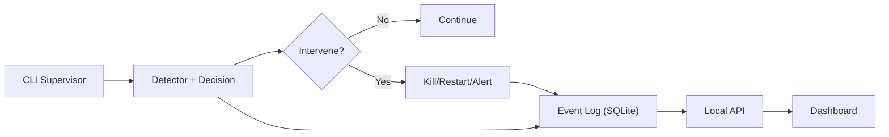
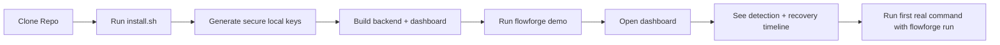
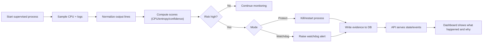
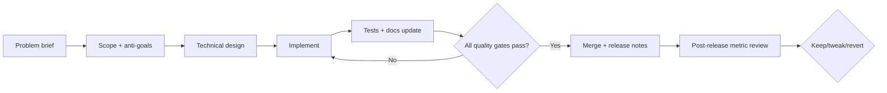
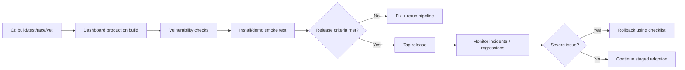
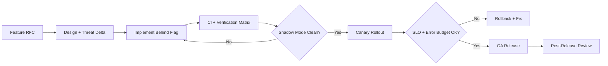

# FlowForge Product Execution Plan

Date: 2026-02-18
Owner: Product + Engineering
Scope: Local-first process supervision product (no SaaS, no multi-tenant, no billing)

---

## 1) Executive Summary

FlowForge should be operated as a focused reliability product for runaway process protection.
The fastest path to a high-trust product is:

1. Keep the product local-first and narrow.
2. Make first value obvious in under 60 seconds.
3. Make every intervention explainable.
4. Prioritize reliability and trust before expanding scope.
5. Delay enterprise-looking complexity until core behavior is proven.

This plan turns the repo into an execution workflow with phase gates, quality bars, and timelines.

---

## Reading Order (Final)

Use this sequence when executing the plan end-to-end:

1. Product mission and positioning (`Executive Summary`, `Brutal Truths`, `Product Positioning`, `Final Master Goal`)
2. Experience design (`Simplified Mental Model`, `Onboarding Flow`, `Cloudflare-Style Website Blueprint`, `Customer Journey Workflow`)
3. Core architecture (`Reduced Architecture`, `Platform Planes`, `Data Contracts and Schema Governance`)
4. Feature strategy (`Feature Workflow`, `Feature Tracks`, `Complete Feature Universe`, `Anti-Overbuild Rules`)
5. Reliability and security (`SLO/SLI/Error Budget`, `Security Program`, `Verification Matrix`, `Risk Register`)
6. Operations and releases (`Operational Workflows`, `Release Safety Workflow`, `12-Week/18-Month timelines`, `Scoreboard Dashboard`)
7. Team execution (`Team Topology`, `Operating Cadence`, `Immediate 30-Day Expansion Tasks`, `Delivery Milestones`)

Note:
- Section numbers are identifiers, not strict priority order.
- Priority is defined by P0/P1/P2, SLO risk, and milestone exit criteria.

---

## Priority Stack (Authoritative)

If any sections conflict, this stack wins.

### P0 (Now, Day 0-30) - Must Ship First

Goal:
- make FlowForge reliable, explainable, and easy to activate.

Must-complete outcomes:
1. one-command install + deterministic 60-second demo success
2. first real workload protected in <= 5 minutes
3. unified intervention reason format (what/why/action/outcome)
4. lifecycle correctness (shutdown, cleanup, restart safety)
5. release checkpoint as mandatory merge/release gate
6. stable benchmark corpus and tracked fp/fn baseline
7. docs clarity: README + runbook + threat model + troubleshooting consistency
8. website skeleton with `Start in 60s`, docs, reliability, security, changelog

P0 deliverables:
1. onboarding path (`install -> demo -> protect`) validated with 3 fresh-user tests
2. reliability pack run weekly (pilot, tuning, recovery drill, checkpoint)
3. explicit rollback procedure tested and timed
4. top-10 operator failure playbooks documented

### P1 (Next, Day 31-90) - Zero-Command Adoption

Goal:
- remove command fatigue and make daily use near-frictionless.

Must-complete outcomes:
1. local daemon mode stable
2. Cursor integration MVP (enable protection, status, incidents, pause/resume)
3. Antigravity integration MVP with same core controls
4. workspace auto-detect and auto-attach flow
5. policy dry-run + canary rollout controls
6. unified event schema migration plan and first implementation slice

P1 deliverables:
1. IDE integration API contract and compatibility tests
2. no-command onboarding flow validated with external pilot users
3. explainability preserved in all IDE-triggered actions

### P2 (Later, Day 91-180) - Platform Hardening and Scale

Goal:
- raise operational maturity to platform-grade consistency.

Must-complete outcomes:
1. SLO/error-budget governance in weekly operations
2. deeper chaos, soak, and endurance programs
3. release train automation with canary/rollback controls
4. forensic export, replay, and incident trend tooling
5. interop connectors (webhooks, issue tracker, SIEM-friendly stream)

P2 deliverables:
1. repeatable low-regression release cadence
2. evidence-backed trust pages (reliability/security/status/changelog)
3. quarterly roadmap execution with measurable KPI movement

### Explicitly Deferred Until P0 + P1 Exit

Do not prioritize before P0/P1 exit criteria are met:
1. broad integration surface beyond Cursor/Antigravity core path
2. advanced enterprise abstractions not tied to active design-partner demand
3. heavy policy DSL complexity without proven usage
4. secondary analytics features that do not improve intervention trust
5. UI polish work that does not improve onboarding speed or explainability

### Critical Path Dependencies

1. reliability before automation depth
- if lifecycle/shutdown is unstable, no expansion of integrations

2. explainability before autonomous action expansion
- if users cannot understand actions, no higher automation levels

3. release discipline before broader rollout
- if checkpoint/rollback is not repeatable, do not widen adoption

4. docs clarity before traffic scaling
- if onboarding docs are unclear, do not increase acquisition spend/effort

### Execution Stop Rules

Immediately pause feature expansion when any condition is true:
1. false-positive trend exceeds target for 2 consecutive weekly reviews
2. rollback drill fails or exceeds agreed recovery window
3. crash-free session target regresses for 2 consecutive releases
4. intervention explainability completeness drops below 100%

---

## 2) Brutal Truths (Non-Negotiable)

1. Distribution beats architecture quality if users cannot discover and adopt the product.
2. A security/reliability tool is judged by false positives and trust, not UI polish.
3. If a user cannot explain why a process was killed, confidence collapses.
4. Complex architecture before usage data creates rework and slows delivery.
5. Most failures will come from operational discipline gaps, not missing features.
6. Cloudflare-level quality requires years of systems/process maturity, not one big rewrite.
7. A small team must win by focus: one persona, one painful problem, one excellent workflow.

---

## 3) Product Positioning (Current)

FlowForge is a local process guardrail that detects runaway behavior, intervenes safely, and explains every decision with auditable evidence.

Primary user now:
- Dev teams running long-lived AI agent jobs and automation scripts on laptops or CI runners.

Primary pain now:
- Jobs that silently loop, consume CPU, and waste time/resources.

---

## 4) Simplified Mental Model (4 Concepts)

1. Supervisor
- Starts and monitors one child process.

2. Decision
- Evaluates CPU/output repetition and computes confidence.

3. Action
- Continue, alert, kill, or restart.

4. Evidence
- Stores what happened, why it happened, and who triggered actions.

If every feature does not improve one of these four, postpone it.

---

## 5) Reduced Architecture (Target)

Key simplification rule:
- Prefer one event model that powers both timeline and decision explainability.

---

## 5.1) Node-Connected Workflows

### A) User Onboarding Workflow

ASCII fallback (plain text):
[Clone Repo] -> [Run install.sh] -> [Generate secure local keys] -> [Build backend + dashboard] -> [Run flowforge demo] -> [Open dashboard] -> [See detection + recovery timeline] -> [Run first real command with flowforge run]

### B) Runtime Detection Workflow

ASCII fallback (plain text):
[Start supervised process] -> [Sample CPU + logs] -> [Normalize output] -> [Compute scores] -> (Risk high?)
No -> [Continue monitoring]
Yes -> (Mode)
Protect -> [Kill/restart] -> [Write evidence to DB] -> [API serves state/events] -> [Dashboard explains what/why]
Watchdog -> [Raise alert] -> [Write evidence to DB] -> [API serves state/events] -> [Dashboard explains what/why]

### C) Feature Delivery Workflow (Engineering)

ASCII fallback (plain text):
[Problem brief] -> [Scope + anti-goals] -> [Technical design] -> [Implement] -> [Tests + docs update] -> (All gates pass?)
No -> [Implement]
Yes -> [Merge + release notes] -> [Post-release metric review] -> [Keep / tweak / revert]

### D) Release Safety Workflow

ASCII fallback (plain text):
[CI build/test/race/vet] -> [Dashboard production build] -> [Vulnerability checks] -> [Install/demo smoke] -> (Release criteria met?)
No -> [Fix + rerun pipeline]
Yes -> [Tag release] -> [Monitor incidents/regressions] -> (Severe issue?)
Yes -> [Rollback checklist]
No -> [Continue staged adoption]

---

## 6) Feature Workflow (Detailed)

Every feature must move through this exact workflow.

## 6.1 Workflow Stages

1. Problem Definition
- Output: one-page feature brief.
- Must include:
  - User pain statement.
  - Current workaround.
  - Why now.
  - Success metric.

2. Scope Decision
- Output: in/out list.
- Must include:
  - Must-have behavior.
  - Explicit anti-goals.
  - What will NOT be built now.

3. Technical Design
- Output: short design doc.
- Must include:
  - Data flow changes.
  - API/storage impact.
  - Failure modes and rollback.

4. Build
- Output: PR with tests and docs.
- Must include:
  - Unit/integration tests.
  - Migration safety.
  - Backward compatibility notes.

5. Verify
- Output: verification report.
- Must include:
  - Build/test/race/vet results.
  - Dashboard build result.
  - Security checks result.
  - Manual smoke scenario.

6. Release
- Output: release notes.
- Must include:
  - User-visible change.
  - Config changes.
  - Upgrade steps.
  - Known caveats.

7. Learn
- Output: post-release decision.
- Must include:
  - Metric impact after 1-2 weeks.
  - Keep/tweak/revert decision.

## 6.2 Stage Gates (Go/No-Go)

A feature cannot merge unless all are true:
- Gate A: Clear user pain and metric.
- Gate B: Scope and anti-goals documented.
- Gate C: Tests + docs updated.
- Gate D: No regression in run/demo onboarding flow.
- Gate E: Explainability preserved (reason is visible).

---

## 7) Feature Tracks and Priority Workflow

## 7.1 Track A - First 60-Second Value (P0)

Goal:
- New user experiences clear value in under 60 seconds.

Feature workflow order:
1. Installer reliability.
2. Demo determinism.
3. First-run messaging clarity.
4. Dashboard confirmation state.

Definition of done:
- Fresh machine install works in one command.
- Demo always shows detect -> intervene -> recover summary.
- User sees one clear timeline card explaining intervention.

## 7.2 Track B - Core Protection Reliability (P0)

Goal:
- Supervision behavior is correct and stable under real workloads.

Feature workflow order:
1. Detection signal tuning.
2. Intervention safety.
3. Process lifecycle edge-case handling.
4. Regression test pack.

Definition of done:
- False positive/false negative rates measured on a benchmark corpus.
- No goroutine leaks or shutdown orphan processes in tested scenarios.

## 7.3 Track C - Trust and Explainability (P0)

Goal:
- Every action is understandable by a developer in under 30 seconds.

Feature workflow order:
1. Unified reason text format.
2. Timeline simplification.
3. Decision evidence standardization.
4. Audit clarity.

Definition of done:
- For each intervention: what happened, why, and action outcome are present.

## 7.4 Track D - Operational Hardening (P1)

Goal:
- Product behaves predictably in production-like environments.

Feature workflow order:
1. Release pipeline reliability.
2. Dependency and vulnerability hygiene.
3. Runtime defaults hardening.
4. Operational runbook maturity.

Definition of done:
- CI green on all required checks.
- Vulnerability process documented and repeatable.

## 7.5 Track E - Scope Control (Always On)

Goal:
- Prevent feature creep and premature complexity.

Rules:
- Any feature not tied to current top-3 user pains gets deferred.
- Any architectural abstraction without proven usage is deferred.
- Any UI complexity that does not improve explanation quality is deferred.

---

## 8) What to Temporarily Remove or Consolidate

1. Consolidate overlapping evidence models
- Current: incidents + audit events + decision traces.
- Simplified target: one events pipeline with typed event categories.

2. Reduce alert mode branching in UI language
- Keep behavior, simplify wording to avoid overwhelming new users.

3. Remove non-core analytics from primary dashboard path
- Token/cost/savings can be secondary detail, not primary onboarding.

4. Trim non-essential command/doc noise
- Keep core commands prominent: run, demo, dashboard.

5. Avoid premature policy engine complexity
- Keep a small policy surface until real-world usage demands more.

---

## 9) 12-Week Detailed Timeline (Execution Plan)

## Weeks 1-2: Clarity + Scope Lock

Outcomes:
- Product story, architecture, and onboarding are coherent.

Deliverables:
1. README rewrite with:
- 60-second quickstart.
- 4-concept mental model.
- one architecture diagram.
- troubleshooting basics.

2. Terminology standardization:
- define exact terms: incident, decision, action, event.

3. Feature freeze policy:
- no net-new feature classes during 12-week cycle.

Exit criteria:
- New dev can explain product flow in 5 minutes.

## Weeks 3-4: Core Loop Reliability

Outcomes:
- run/demo path is deterministic and robust.

Deliverables:
1. Detection benchmark harness (fixture scripts).
2. Process lifecycle test matrix.
3. Graceful shutdown validation.
4. Decision reason formatting standard.

Exit criteria:
- benchmark report exists.
- no critical lifecycle failures in matrix.

## Weeks 5-6: Evidence Simplification

Outcomes:
- one coherent event narrative in backend + UI.

Deliverables:
1. Event model simplification design.
2. migration plan for existing DB schema.
3. timeline rendering simplification.
4. reason panel consistency check.

Exit criteria:
- user can trace one event end-to-end with no ambiguity.

## Weeks 7-8: Operational Hardening

Outcomes:
- repeatable secure release behavior.

Deliverables:
1. release checklist.
2. rollback checklist.
3. security maintenance checklist.
4. docs for API auth and local bind defaults.

Exit criteria:
- release dry-run succeeds with checklist compliance.

## Weeks 9-10: Pilot Readiness

Outcomes:
- ready for limited external pilot users.

Deliverables:
1. pilot onboarding guide.
2. issue intake template.
3. incident triage playbook.
4. top 10 failure-mode runbook entries.

Exit criteria:
- pilot users can self-serve onboarding with minimal support.

## Weeks 11-12: Stabilize and Decide

Outcomes:
- confidence to continue, narrow, or pivot.

Deliverables:
1. KPI review report.
2. top regressions and root cause summary.
3. next-quarter prioritized backlog.

Exit criteria:
- written keep/tweak/revert decisions for all major changes.

---

## 10) 12-Month Roadmap (Quarterly)

Q1 (0-3 months): Core Product Clarity
- deterministic onboarding and demo.
- stable supervision loop.
- clear evidence model.

Q2 (3-6 months): Pilot Reliability
- benchmark-backed detection tuning.
- hardening of release and runtime defaults.
- pilot user retention feedback loop.

Q3 (6-9 months): Production Readiness
- versioned API behavior commitments.
- stronger upgrade/migration story.
- comprehensive runbook maturity.

Q4 (9-12 months): Team Adoption
- improved team workflows and policy controls.
- selective integrations only if driven by pilot demand.

---

## 11) Success Metrics and Targets

## 11.1 Onboarding Metrics

1. Time-to-first-value
- Target: <= 5 minutes from clone to first successful demo.

2. Demo completion rate
- Target: >= 95% on supported environments.

## 11.2 Protection Metrics

1. Detection latency
- Target: intervention decision in <= 5 seconds for runaway fixtures.

2. False positive rate
- Target: <= 2% on benchmark corpus before broader rollout.

3. False negative rate
- Target: continuously tracked and reduced each sprint.

## 11.3 Reliability Metrics

1. Crash-free supervised sessions
- Target: >= 99%.

2. API availability (local runtime)
- Target: >= 99.9% during active session.

3. Clean shutdown success
- Target: >= 99% in lifecycle tests.

## 11.4 Trust Metrics

1. Explainability completeness
- Target: 100% of interventions include reason + action + outcome.

2. User confidence score (survey)
- Target: steady increase sprint-over-sprint.

---

## 12) Engineering Quality Workflow

## 12.1 PR Checklist (Required)

- [ ] Problem statement included in PR body.
- [ ] Scope and anti-goals listed.
- [ ] Unit/integration tests added or updated.
- [ ] Race detector clean.
- [ ] Vet/static/vuln checks clean.
- [ ] Dashboard build clean.
- [ ] README/docs updated if behavior changed.
- [ ] Rollback note included.

## 12.2 Testing Pyramid

1. Unit tests
- decision scoring math.
- auth/rate-limit behavior.
- parsing and normalization.

2. Integration tests
- run loop + DB writes.
- API endpoints with auth.
- timeline rendering contract.

3. Behavior tests
- runaway fixture.
- noisy but healthy fixture.
- restart path fixture.

4. Release smoke tests
- install script.
- demo execution.
- dashboard connection.

---

## 13) Security and Trust Workflow

1. Secrets discipline
- No committed keys or runtime state files.
- Enforced .gitignore and secret scanning checks.

2. Auth discipline
- mutating endpoints require key.
- constant-time compare remains mandatory.

3. Runtime exposure
- localhost bind default.
- strict CORS policy for local origins only.

4. Vulnerability maintenance
- recurring vuln check cadence.
- patch policy for toolchain and dependencies.

5. Disclosure discipline
- clear SECURITY.md and issue response timeline.

---

## 14) Documentation Workflow

Required docs and owner responsibilities:

1. README (Product owner)
- must tell the full story in one pass.
- must include quickstart, architecture, and common failures.

2. OPERATIONS.md (Infra owner)
- install/runbook/upgrade/rollback.

3. THREAT_MODEL.md (Security owner)
- trust boundaries and attack surface.

4. CHANGELOG (Release owner)
- user-facing diffs and migration notes.

Documentation quality gate:
- if behavior changes and docs are stale, PR does not merge.

---

## 15) Simplified Onboarding Flow (Target UX)

1. Clone repo.
2. Run install script.
3. Watch demo detect and recover.
4. Open dashboard and see one clear reason timeline.
5. Run one real command under supervision.

Expected first-run message quality:
- one sentence per step.
- no ambiguous debug language.
- clear next action on error.

---

## 16) Backlog Prioritization Framework

Priority model:
- P0: directly improves onboarding speed, core reliability, or trust.
- P1: improves operational quality but not critical for first value.
- P2: useful later; postpone unless user demand is explicit.

Current examples:

P0:
- README simplification.
- event model coherence.
- detection benchmark + false-positive tuning.
- lifecycle/shutdown reliability.

P1:
- deeper metrics refinement.
- optional UI polish around secondary stats.

P2:
- advanced policy abstractions.
- broad integration surface.
- anything not tied to current top-3 pain points.

---

## 17) Team Operating Cadence

Daily:
- 15-minute standup.
- blockers, incidents, active risks.

Weekly:
- reliability review (test failures, regressions, false positives).
- user feedback review.
- roadmap adjustment check.

Bi-weekly:
- release train with checklist review.
- post-release metric check.

Monthly:
- architectural debt review.
- threat model update check.

Quarterly:
- strategic scope reset.
- kill non-performing feature lines.

---

## 18) Risk Register (Top Risks + Mitigations)

1. Risk: False positives reduce trust.
- Mitigation: benchmark suite + explainability requirement + staged rollout.

2. Risk: Lifecycle bugs orphan processes.
- Mitigation: lifecycle matrix + forced kill fallback + shutdown tests.

3. Risk: Scope creep slows core quality.
- Mitigation: strict P0/P1/P2 governance and anti-goal review.

4. Risk: Documentation drift.
- Mitigation: doc update merge gate.

5. Risk: Security regressions.
- Mitigation: auth tests + vuln checks + secret scanning discipline.

---

## 19) Kill Criteria (When to Stop or Pivot)

If after two full quarterly cycles:
- time-to-first-value not improving,
- false positives still unacceptable,
- pilot retention weak,

then reduce scope further and revalidate core problem before adding any new features.

---

## 20) Immediate Next Actions (Next 7 Days)

1. Finalize README rewrite aligned to this plan.
2. Define and implement benchmark fixture set.
3. Create one-page feature brief template and enforce in PRs.
4. Publish release checklist and rollback checklist.
5. Run one end-to-end onboarding usability test with a new developer.

---

## 21) One-Paragraph Positioning Statement

FlowForge is a local reliability guardrail for long-running scripts and AI agent workflows: it supervises execution, detects runaway behavior, intervenes safely, and records clear, auditable reasons for every action so developers can trust automation without losing control.

---

## 22) Appendix - Feature Workflow Template

Use this template for every feature request:

1. Feature Name:
2. User Pain:
3. Success Metric:
4. In Scope:
5. Out of Scope:
6. Architecture Impact:
7. Failure Modes:
8. Test Plan:
9. Docs Impact:
10. Rollback Plan:
11. Release Validation:
12. Post-Release Review Date:

---

## 23) Ideal Domain Expansion Map (Cloudflare-Style Breadth, Sequenced)

Purpose:
- keep a large long-term vision without breaking short-term focus.
- expand by domains only after hard readiness gates are met.

Domain sequencing rule:
1. Core Runtime Reliability (must be excellent first)
2. Security Controls
3. Policy and Governance
4. Observability and Forensics
5. Deployment Surface
6. Ecosystem and Integrations

Readiness gate before opening any new domain:
- onboarding <= 5 minutes
- false-positive rate within target
- crash-free session target met
- release checklist and rollback drills passing
- docs/runbooks current

### Domain A) Core Runtime Reliability

Scope:
- stronger runaway classification profiles
- bounded restart policies
- deterministic shutdown and child cleanup
- command resource guardrails (cpu/mem/token-rate)

Example features:
- per-command runtime profile presets
- restart backoff and max restart window
- stuck-process timeout policy
- run replay summary from persisted events

Unlock criteria:
- baseline domain; always active until mature.

### Domain B) Security Controls

Scope:
- local auth hardening
- secret hygiene
- execution safety boundaries

Example features:
- signed local action approvals (optional)
- stricter endpoint permission tiers
- immutable audit export bundle
- key rotation helper workflow

Unlock criteria:
- Domain A stable with low operational incidents.

### Domain C) Policy and Governance

Scope:
- reusable policy packs for teams
- policy validation/linting
- policy simulation before enforcement

Example features:
- policy dry-run mode with impact report
- profile registry for team-standard policies
- confidence threshold policy packs by workload type
- policy conflict checker

Unlock criteria:
- Domain A and B stable, with clear user demand for shared policy.

### Domain D) Observability and Forensics

Scope:
- high-clarity operational timeline
- deeper forensic context for interventions
- robust benchmark and incident analytics

Example features:
- event correlation view (incident + decision + action chain)
- benchmark trend tracking across commits
- forensic export command (sanitized)
- anomaly score drift report

Unlock criteria:
- Domain A baseline metrics stable for two release cycles.

### Domain E) Deployment Surface

Scope:
- repeatable deployment across environments
- hardened packaging and upgrade safety

Example features:
- hermetic build profile
- offline install bundle
- migration preflight checker
- host capability validator

Unlock criteria:
- runbooks mature and rollback drills proven.

### Domain F) Ecosystem and Integrations

Scope:
- connect to existing dev workflows without bloating core

Example features:
- CI adapters (consume events and enforce policy outcome gates)
- chat notifications for intervention summaries
- issue tracker incident export
- SIEM-friendly JSON event stream exporter

Unlock criteria:
- Domain A-D stable and clear integration pull from users.

---

## 24) Feature Universe Backlog (Ideal, Not Immediate)

These are intentionally broad and should remain parked until domain gates open.

Reliability universe:
- workload fingerprinting
- adaptive threshold tuning from local history
- bounded auto-remediation playbooks
- run safety scorecard

Security universe:
- tamper-evident local audit chain
- host integrity prechecks before run
- secret source scanning of process output channels
- policy-based kill approval modes

Policy universe:
- policy templates by language/runtime
- policy provenance metadata
- policy test harness fixtures
- policy rollout canary mode

Observability universe:
- incident diff between two runs
- confidence decomposition timeline
- postmortem report generator from event graph
- benchmark comparison CLI

Operations universe:
- upgrade planner with migration checks
- environment compatibility matrix command
- release health snapshot command
- disaster recovery checklist automation

Integrations universe:
- git hook guardrail mode
- pipeline status gate mode
- message bus exporter (local forwarding)
- standardized event schema adapters

---

## 25) Anti-Overbuild Rules For Domain Expansion

1. No domain expansion if P0 metrics are below target.
2. No new domain features without a named design-partner request pattern.
3. No architecture abstraction added unless used by at least two active features.
4. No integration feature before core event schema is stable for two cycles.
5. Every new domain feature must include removal criteria if adoption is weak.

---

## 26) Domain Planning Template

Use this before opening a domain:

1. Domain Name:
2. Why now:
3. User pull evidence:
4. Prerequisite gates status:
5. First 3 features (max):
6. Success metrics:
7. Failure signals:
8. Rollback/retire plan:

---

## 27) Cloudflare-Level North Star (Long-Range)

FlowForge long-range goal:
- become a high-trust reliability and protection layer for runtime workloads, with explainable automated intervention, strong security defaults, and production-grade operational controls.

North-star outcomes:
1. Intervention decisions are accurate, explainable, and reversible.
2. Runtime protections are always-on and safe by default.
3. Operators can enforce policy at scale without losing local developer speed.
4. Platform upgrades are boring, repeatable, and low-risk.
5. Every failure mode has a tested runbook and rollback path.

Guardrail:
- Expand feature surface only when reliability, trust, and onboarding targets are met.

---

## 28) Platform Planes (Target Architecture)

### Plane A: Runtime Agent Plane

Responsibilities:
- process supervision and lifecycle control
- signal collection (cpu, memory, io, logs)
- decision scoring and policy evaluation
- action execution (continue, alert, kill, restart, isolate)

Must-have features:
1. process tree ownership and cleanup
2. graceful shutdown with bounded force-kill fallback
3. deterministic restart backoff and jitter
4. resource guards (cpu, memory, wall-time)
5. decision trace emission for every intervention

### Plane B: Local Control Plane

Responsibilities:
- API endpoints for state, incidents, actions, policies
- authn/authz and audit trail
- config lifecycle and validation

Must-have features:
1. API key and service token support
2. constant-time token compare
3. per-endpoint auth policy matrix
4. local-only secure bind default
5. schema-validated config updates

### Plane C: Policy Plane

Responsibilities:
- define what is risky
- define what action to take
- define when automation requires manual approval

Must-have features:
1. policy schema versioning
2. policy dry-run mode with impact preview
3. policy packs by workload type
4. policy precedence and conflict checks
5. policy rollout controls (shadow, canary, enforce)

### Plane D: Evidence and Data Plane

Responsibilities:
- durable incident/audit/decision event storage
- timeline and forensic retrieval
- retention and export

Must-have features:
1. unified event model with typed event categories
2. append-only event history guarantees
3. event correlation id across one incident chain
4. export bundle with redaction guarantees
5. retention policy and compaction controls

### Plane E: Observability Plane

Responsibilities:
- metrics, traces, logs, health signals
- SLO reporting and alerting
- benchmark trend tracking

Must-have features:
1. Prometheus metrics with stable cardinality
2. OpenTelemetry traces for action pipeline
3. health/readiness/degraded endpoints
4. burn-rate alerts for SLO violations
5. incident quality scorecards

### Plane F: Delivery and Operations Plane

Responsibilities:
- build, test, release, rollback, upgrade
- vulnerability and dependency governance
- production readiness gates

Must-have features:
1. reproducible builds
2. signed release artifacts
3. release checkpoint and rollback drills
4. automated dependency and vuln checks
5. migration preflight and rollback guardrails

---

## 29) Complete Feature Universe (Sequenced)

This is the target universe. Do not build all at once.

### Domain 1: Core Supervision Engine

1. single-command supervision with process-group ownership
2. cpu, memory, io, and wall-time threshold guards
3. output repetition detection and entropy scoring
4. multi-signal confidence score
5. bounded action policies (alert/kill/restart/isolate)
6. restart budgets (max restarts per window)
7. startup grace periods and warmup windows
8. stuck-progress detector (heartbeat and progress timeout)
9. crash-loop detector with suppression windows
10. controlled pause mode and maintenance windows

### Domain 2: Decision Intelligence and Explainability

1. reason template standardization
2. confidence breakdown (cpu, entropy, trend, policy hit)
3. decision replay from raw evidence
4. decision diff across versions
5. explainability completeness validator
6. confidence threshold tuning assistant
7. false-positive review workflow
8. false-negative review workflow
9. regression fixtures for high-risk patterns
10. model-less deterministic fallback mode

### Domain 3: API and Action Security

1. endpoint-level auth matrix
2. role-based action permissions
3. anti-bruteforce rate limiting
4. action cooldowns and idempotency keys
5. signed action requests option
6. per-action approval requirement policy
7. local mTLS for advanced deployments
8. rotating key lifecycle tooling
9. audit-immutable action log
10. emergency lockout mode

### Domain 4: Incident and Audit Data

1. unified event schema (incident, decision, action, outcome)
2. event lineage and causal linking
3. incident lifecycle states
4. actor attribution for manual interventions
5. retention classes (hot, warm, archive)
6. forensic export with checksum manifest
7. incident replay report generator
8. data integrity checks
9. migration-safe schema evolution
10. historical query performance budgets

### Domain 5: Dashboard and Operator UX

1. live health panel with risk summary
2. incident timeline with reason-first cards
3. action outcome panel (what changed)
4. confidence explanation panel
5. policy hit visualization
6. manual action controls with confirmation safety
7. incident filter/search with saved views
8. drift and trend panels (fp/fn, latency, restart rate)
9. run-level forensic view
10. operator guidance text for each failure class

### Domain 6: Zero-Command Integrations (Critical)

1. local daemon mode (always-on supervisor)
2. workspace auto-discovery
3. auto-attach to active dev process
4. cursor extension: enable/disable protection toggle
5. cursor extension: incident side panel
6. antigravity integration: attach/status/actions
7. launch hooks for npm/go/python common commands
8. deep-link from IDE to incident detail
9. one-click policy preset selection
10. local integration diagnostics panel

### Domain 7: Reliability and Recovery Engineering

1. graceful shutdown matrix (signals and parent death)
2. orphan process prevention guarantees
3. restart correctness under partial failures
4. action execution timeout and retries
5. state restore on supervisor restart
6. watchdog for supervisor self-health
7. fail-safe mode when policy/config invalid
8. deterministic fallback config
9. recovery drills as code
10. periodic chaos/fault-injection suite

### Domain 8: Performance and Capacity

1. detection latency budget tracking
2. resource overhead budget tracking
3. benchmark harness for real workloads
4. profile-guided optimization loop
5. event ingestion throughput tests
6. timeline query latency tests
7. memory leak detection tests
8. sustained soak and endurance tests
9. load-shed behavior under stress
10. capacity planning dashboards

### Domain 9: Supply Chain and Platform Security

1. SBOM generation and attestation
2. dependency drift and vuln SLA policy
3. build provenance and signing
4. secret scanning with fail gates
5. static analysis and lint policy
6. fuzzing for parsers and normalization
7. binary hardening flags
8. container hardening baseline
9. least-privilege runtime defaults
10. security incident response playbook

### Domain 10: Deployment and Fleet Operations

1. local single-node deploy profile
2. multi-node self-hosted profile
3. environment promotion pipeline (dev/stage/prod)
4. canary deployment controls
5. blue-green rollback path
6. migration preflight checks
7. config drift detection
8. backup and restore automation
9. disaster recovery game days
10. release train automation

### Domain 11: Enterprise Trust and Compliance (Later)

1. immutable audit evidence package
2. policy change approval trail
3. access review workflows
4. data retention enforcement by policy
5. compliance evidence export templates
6. signed incident postmortem packages
7. security baseline conformance checks
8. change-management reporting
9. runbook execution evidence tracking
10. periodic trust posture scorecards

### Domain 12: Ecosystem and Interop

1. webhook action/event integrations
2. issue tracker incident export
3. chatops intervention summaries
4. SIEM-compatible event streaming
5. OpenAPI stability and SDK generation
6. policy import/export tooling
7. CI gate mode for workload protection checks
8. workflow automation connectors
9. external evidence archive integration
10. schema compatibility contract tests

---

## 30) Cloud-Scale Workflow (Idea to Production)

Every feature follows this 10-step workflow.

1. Problem brief with measurable user pain
2. Scope and anti-goals written and approved
3. Threat model delta and failure mode analysis
4. Design review with rollback and migration plan
5. Implementation with feature flags
6. Test matrix execution (unit/integration/behavior/race/fuzz)
7. Shadow mode validation on real workloads
8. Canary rollout with error-budget guardrails
9. General availability with docs and runbooks
10. Post-release review with keep/tweak/revert decision

Mandatory artifacts per feature:
- feature brief
- design note
- test evidence
- release note
- rollback playbook delta
- metric impact report

---

## 31) Multi-Stage Release Workflow (Node-Connected)

Promotion guardrails:
1. no unresolved P0 defects
2. no unexplained SLO regressions
3. release checkpoint pass required
4. rollback dry-run less than 15 minutes

---

## 32) Reliability Objectives (SLO/SLI/Error Budget)

### SLO Group A: Detection and Action

1. decision latency p95 <= 2s
2. intervention completion p95 <= 5s
3. false-positive rate <= 1% on benchmark corpus
4. false-negative trend decreasing release-over-release

### SLO Group B: Runtime Stability

1. crash-free supervisor sessions >= 99.5%
2. clean shutdown success >= 99.5%
3. orphaned child processes = 0 in verified drills

### SLO Group C: API and Dashboard

1. local API availability during active sessions >= 99.9%
2. timeline query p95 <= 300ms (local profile)
3. dashboard first paint <= 2s in standard dev machine profile

Error budget policy:
- If monthly budget is exhausted, freeze new features and ship only reliability fixes until budget recovers.

---

## 33) Security Program (Required for Trust)

1. security design review for every P0/P1 feature
2. threat model update each release cycle
3. mandatory auth tests for mutating endpoints
4. constant-time token compare regression test
5. secret scanning in CI and pre-release gates
6. monthly dependency and toolchain patch window
7. quarterly security chaos drills
8. mandatory incident response runbook validation
9. signed release artifacts and provenance checks
10. vulnerability triage SLA matrix

Vulnerability SLA example:
- critical: patch or mitigate in 24h
- high: patch or mitigate in 7 days
- medium: patch in 30 days
- low: scheduled backlog

---

## 34) Verification Matrix (Full Quality Gate)

### Test Layers

1. unit tests for scoring, policies, auth checks
2. integration tests for api, db, lifecycle
3. behavior fixtures (runaway, healthy burst, crash-loop, hang)
4. race detector and leak detection checks
5. fuzz tests for parsers and redactors
6. load tests for event and timeline endpoints
7. soak tests for multi-day stability
8. chaos tests for signal loss, slow disk, api timeouts

### Release Gate Checklist

1. build/test/race/vet pass
2. staticcheck and govulncheck pass
3. dashboard production build pass
4. install and demo smoke pass
5. recovery drill pass
6. release checkpoint pass
7. rollback drill pass
8. docs and runbook diffs complete

---

## 35) Data Contracts and Schema Governance

1. one canonical event envelope schema
2. schema versioning with backward-compatible reads
3. strict validation before persistence
4. nullable-field discipline and deprecation windows
5. migration scripts with checksum verification
6. contract tests for api and dashboard consumers
7. event replay harness for compatibility checks
8. explicit retention and compaction strategy

Event envelope minimum fields:
- event_id
- run_id
- incident_id
- event_type
- actor
- reason
- scores
- action
- outcome
- created_at
- schema_version

---

## 36) Integration Blueprint (Cursor + Antigravity)

Goal:
- user gets protection without typing repetitive commands.

Architecture:
1. local daemon process starts on login or first use
2. IDE extension registers workspace with daemon
3. daemon discovers active command or launch task
4. daemon attaches supervision profile automatically
5. extension shows health and incidents inline
6. one-click intervene controls call local daemon API

MVP integration feature set:
1. enable protection toggle
2. choose profile (standard/strict/watchdog)
3. show latest incident reason and action
4. open timeline deep-link
5. pause/resume supervision

Safety requirements:
1. no silent destructive action without policy approval
2. full audit trail for IDE-triggered actions
3. visible indicator when protection is active

---

## 37) Operational Workflows (Detailed)

### Workflow A: New Workload Onboarding

1. select profile preset
2. run in shadow mode for baseline capture
3. review baseline report and suggested thresholds
4. enable enforce mode
5. monitor first 24h with tuned alerts

### Workflow B: Incident Response

1. detect incident and classify severity
2. inspect reason and confidence breakdown
3. validate expected vs unexpected behavior
4. execute action or override with reason
5. capture post-incident notes
6. create follow-up fix and policy adjustment

### Workflow C: Safe Policy Change

1. edit policy in dry-run
2. run impact simulation on historical events
3. apply to canary workloads
4. verify no major fp/fn regressions
5. roll out broadly

### Workflow D: Release and Rollback

1. freeze non-release changes
2. run release checkpoint + soak snapshot
3. publish release and monitor burn-rate
4. if severe regression, rollback via playbook
5. publish incident and remediation notes

---

## 38) 18-Month Detailed Timeline

### Phase 0 (Month 0-1): Foundation Lock

Outcomes:
1. docs and onboarding clarity complete
2. week1 and week2 reliability pack repeatable
3. release checkpoint enforced for all releases

### Phase 1 (Month 2-3): Engine Reliability

Outcomes:
1. lifecycle correctness and shutdown guarantees
2. benchmark corpus and fp/fn baselines
3. unified reason formatting in UI/API

### Phase 2 (Month 4-6): Zero-Command Adoption

Outcomes:
1. local daemon mode GA
2. cursor integration MVP
3. antigravity integration MVP
4. one-click workspace protection flow

### Phase 3 (Month 7-9): Policy and Evidence Maturity

Outcomes:
1. unified event schema migration complete
2. policy dry-run and canary rollout controls
3. forensic export and replay tooling

### Phase 4 (Month 10-12): Production Operations

Outcomes:
1. staged deploy and rollback automation
2. chaos and endurance programs running continuously
3. formal SLO/error-budget governance

### Phase 5 (Month 13-18): Platform Expansion

Outcomes:
1. advanced integrations and interop connectors
2. enterprise trust workflows
3. hardened fleet operations patterns

---

## 39) Team Topology and Ownership

Required ownership lanes:
1. runtime engine
2. control plane api
3. dashboard and operator ux
4. reliability and test infra
5. security engineering
6. release and operations
7. integration platform (ide + workflows)

Operating model:
1. each lane owns SLOs and runbooks
2. cross-lane release reviews every two weeks
3. one reliability captain per release cycle

---

## 40) Brutal Truth Addendum (Scaling Edition)

1. You cannot brute-force trust with features; trust comes from low-regression releases.
2. If explainability lags automation, users will disable automation.
3. If incident quality is noisy, users will ignore true positives.
4. If release and rollback are manual, scale will fail.
5. If integration UX is weak, adoption will plateau regardless of engine quality.
6. If quality gates are optional, reliability will decay.

---

## 41) Scoreboard Dashboard (Weekly)

Track weekly and review every Friday:
1. time-to-first-value
2. demo success rate
3. fp/fn rates on benchmark corpus
4. decision latency p95
5. intervention success rate
6. crash-free sessions
7. clean shutdown success
8. unresolved P0 defects
9. release checkpoint pass rate
10. documentation freshness score

Decision rule:
- if 2+ core metrics regress for two consecutive weeks, stop feature expansion and execute reliability sprint.

---

## 42) Immediate 30-Day Expansion Tasks

1. create and enforce PR templates (problem, scope, anti-goals, rollback)
2. add issue intake and incident postmortem templates
3. implement unified event schema design doc and migration plan
4. add canary + shadow mode controls to policy engine
5. ship local daemon RFC for zero-command integrations
6. define Cursor and Antigravity integration API contracts
7. formalize SLO dashboard and error-budget policy doc
8. run first chaos drill and publish findings

---

## 43) Definition of "Cloudflare-Level" for FlowForge

FlowForge is considered cloudflare-level in execution quality when all are true:
1. onboarding is fast and deterministic
2. intervention system is accurate and explainable
3. security defaults are strict and audited
4. releases are low-risk and reversible
5. operators trust the platform under sustained load
6. integrations make protection nearly invisible to adopt

This is a multi-year execution target and depends more on operational discipline than feature count.

---

## A) Cloudflare Service Model Deconstruction (What To Learn, Not Copy Blindly)

Cloudflare succeeds because service delivery is coherent across product, operations, and trust.
FlowForge should adopt these principles in a local-first/self-hosted form.

### A.1 Cloudflare-Style Service Principles

1. Fast activation path
- A user gets meaningful protection quickly, before deep setup.

2. Layered product surface
- Beginner path is simple.
- Advanced controls exist but are progressive, not mandatory on day one.

3. Global trust messaging
- Reliability and security claims are paired with evidence.

4. Strong defaults
- Safe baseline behavior without manual hardening.

5. Clear product taxonomy
- Users always know which product/module solves which problem.

6. Documentation as product
- Docs are navigable, task-oriented, and version-aware.

7. Continuous release discipline
- Small iterative releases with strong rollback capability.

8. Public operational transparency
- Status communication and incident narratives increase trust.

### A.2 FlowForge Equivalent (Local/Self-Hosted Adaptation)

1. Fast activation path
- `install -> demo -> protect first workload` in under 5 minutes.

2. Layered product surface
- Mode 1: one-click protection.
- Mode 2: profile-based tuning.
- Mode 3: policy engineering for advanced operators.

3. Trust messaging with evidence
- Every decision includes reason + scores + action + outcome.
- Release notes include benchmark and soak evidence.

4. Strong defaults
- localhost bind, auth required for mutating actions, safe thresholds.

5. Clear taxonomy
- Runtime Engine, Control API, Policy, Timeline, Integrations.

6. Docs-as-product
- task-first docs, concise runbooks, failure-specific troubleshooting.

7. Release discipline
- enforced checkpoint, canary, rollback drill.

8. Operational transparency
- structured incident records and postmortem templates.

---

## B) Cloudflare-Style Website Blueprint (FlowForge Edition)

Goal:
- Website explains value in 20 seconds.
- User reaches first successful protected run in <= 5 minutes.

### B.1 Top Navigation Information Architecture

Primary nav:
1. Product
2. Solutions
3. Docs
4. Reliability
5. Security
6. Changelog
7. Community
8. Download

CTA buttons:
1. `Start in 60s`
2. `View Demo`

### B.2 Site Map (Required Pages)

1. `/` Home
- clear value proposition
- 60-second demo strip
- explainable intervention proof card
- trust bar (release quality, benchmark, soak)

2. `/product`
- product pillars and modules
- how FlowForge works diagram

3. `/product/runtime-engine`
4. `/product/control-api`
5. `/product/policy`
6. `/product/timeline`
7. `/product/integrations`

8. `/solutions/ai-agents`
9. `/solutions/automation-workers`
10. `/solutions/ci-runners`

11. `/docs`
- onboarding
- runbook
- troubleshooting
- API reference
- version selector

12. `/reliability`
- SLOs, release process, incident learning

13. `/security`
- threat model, hardening defaults, disclosure policy

14. `/status`
- current operational status and incident history format

15. `/changelog`
- user-facing release history

16. `/community`
- examples, templates, support channels

17. `/download`
- install paths for OS/runtime targets

### B.3 Homepage Content Blocks (Exact Order)

1. Hero
- headline: what problem is solved
- subheadline: local-first protection with explainable actions
- CTA: start in 60s

2. Proof in one timeline
- a real incident card:
  - detected signal
  - action taken
  - recovery result

3. How it works (3 steps)
- detect -> decide -> recover

4. Why trust this
- release checkpoint, soak stability, audit evidence

5. Integrations strip
- cursor, antigravity, CLI, API

6. Operator outcomes
- reduce runaway spend/time
- improve incident response speed

7. Quickstart panel
- exactly 3 commands max

8. Footer trust links
- reliability, security, changelog, status

### B.4 Website UX Rules

1. No marketing fluff without evidence.
2. Every major claim links to a proof source.
3. No dead-end pages; every page has next action.
4. Docs and product language must use same terms.
5. Security and reliability are first-class nav entries.

---

## C) Product Packaging and Service Experience

### C.1 Packaging Levels (No SaaS Requirement)

1. Developer Mode
- single-node local use
- ideal for laptop and prototype workloads

2. Team Self-Hosted Mode
- shared policy and incident workflows
- stronger audit and runbook operations

3. Production Hardened Mode
- full release gates, SLO governance, rollback drills, security program

### C.2 Activation Milestones

1. `T+60s`: demo shows detection and recovery
2. `T+5m`: first real command protected
3. `T+1h`: operator understands timeline and action reasons
4. `T+1d`: baseline thresholds tuned for one workload
5. `T+1w`: stable operation with verified release checkpoint cadence

### C.3 “No-Command Fatigue” Experience Target

1. daemon runs locally in background
2. IDE integration enables protection per workspace
3. auto-detect start commands
4. one-click attach and monitor
5. intervention details shown in IDE and dashboard

---

## D) Customer Journey Workflow (End-to-End)

```mermaid
flowchart LR
  A["Discover FlowForge"] --> B["Run Start-in-60s Path"]
  B --> C["See Runaway Detection + Recovery"]
  C --> D["Protect First Real Workload"]
  D --> E["Review Incident Timeline"]
  E --> F["Enable IDE Integration"]
  F --> G["Adopt Daily No-Command Protection"]
  G --> H["Tune Policies + Reliability Targets"]
  H --> I["Operate with Release + Rollback Discipline"]
```

Journey success metrics:
1. first-run success rate
2. activation to first protected workload
3. % workloads running with protection enabled
4. intervention trust score

---

## E) Documentation System Blueprint (Cloudflare-Grade Clarity)

### E.1 Documentation Tree

1. Getting Started
- 60-second install
- first protected workload
- first incident interpretation

2. Core Concepts
- supervisor
- decision
- action
- evidence

3. Operator Guides
- daily operations
- triage
- policy tuning
- release and rollback

4. API Reference
- endpoint behavior
- auth requirements
- response schemas

5. Integrations
- cursor
- antigravity
- CLI automation hooks

6. Reliability Handbook
- SLOs
- error budgets
- incident taxonomy

7. Security Handbook
- threat model
- hardening defaults
- vuln process

### E.2 Docs Quality Gates

1. behavior changes require docs update in same PR
2. docs examples are executable and tested
3. versioned docs track release tags
4. troubleshooting entries map to real incident classes

---

## F) Operational Trust Pages (Public-Facing Style)

These pages make reliability and security visible and credible.

1. Reliability page
- release process
- SLO posture
- rollback philosophy
- last 10 release checkpoint outcomes

2. Security page
- secure defaults
- auth model
- disclosure policy
- patch cadence

3. Status page
- current component status
- incident timeline format
- resolution summaries and corrective actions

4. Changelog page
- user-visible changes only
- migration notes
- risk notes

---

## G) Final Master Goal (Single Sentence)

FlowForge must become the default reliability guardrail for long-running developer workloads by delivering zero-friction activation, explainable autonomous recovery, and production-grade operational trust with consistent low-regression releases.

---

## H) Final Delivery Milestones and Exit Criteria

### Milestone M1: Product Clarity Complete

Exit criteria:
1. website IA and docs IA finalized
2. onboarding <= 5 minutes validated by new developers
3. terminology consistency across CLI/API/UI/docs

### Milestone M2: Engine Trustworthy

Exit criteria:
1. benchmarked fp/fn baselines
2. stable lifecycle and shutdown matrix pass
3. explainability completeness at 100% for interventions

### Milestone M3: Zero-Command Daily Use

Exit criteria:
1. local daemon stable
2. cursor and antigravity MVP integrations usable
3. workspace attach flow one-click operational

### Milestone M4: Production Reliability Discipline

Exit criteria:
1. canary + rollback workflow repeatable
2. release checkpoint + soak evidence attached to releases
3. weekly SLO and error-budget review ongoing

### Milestone M5: Platform-Grade Consistency

Exit criteria:
1. predictable operations under sustained workload
2. security and reliability pages backed by measurable evidence
3. roadmap execution predictable across quarters

---

## I) What “Include All Things” Means Operationally

To avoid future ambiguity, this plan now explicitly covers:
1. product strategy
2. architecture planes
3. full feature universe
4. release and rollback workflow
5. reliability metrics and SLO governance
6. security program and SLA policy
7. integration strategy (cursor/antigravity)
8. website structure and UX
9. documentation system
10. operational trust communication
11. timeline and milestone exits
12. ownership model and execution cadence

No major category needed for execution should remain unstated after this section.

---

## J) Deep Technical Implementation Directives (Requested)

These directives are now part of the plan baseline. They are P0/P1 execution items, not optional research notes.

### J.1 Solving the Zombie Process Problem (Plane A: Runtime)

Objective:
- build a supervisor execution/teardown module that guarantees full cleanup of deep process trees.

Implementation directive:
1. Spawn child commands into a dedicated process group (PGID) on Unix/Linux.
2. Implement `Stop()` with two-phase teardown:
- phase 1: send `SIGTERM` to the entire process group.
- phase 2: wait a configurable graceful window (default 5 seconds).
- phase 3: if any group member remains, send `SIGKILL` to the entire process group.
3. Trap supervisor exit signals (`SIGINT`, `SIGTERM`) and trigger the same teardown path before process exit.
4. Ensure no orphaned subprocesses remain when parent exits unexpectedly.
5. Use standard library only (`os`, `os/exec`, `os/signal`, `syscall`, `context`, `time`).

Design constraints:
1. must handle scripts/binaries that spawn children or grandchildren
2. idempotent `Stop()` behavior (safe if called multiple times)
3. bounded wait times (no indefinite blocking on shutdown)

Test acceptance:
1. fixture with nested child spawns is fully terminated on stop
2. forced parent signal path leaves no residual child processes
3. graceful stop path and force-kill path both exercised in tests

### J.2 Building the Benchmark Corpus (Track B: Reliability)

Objective:
- create a deterministic fixture suite that validates detection while preventing false positives.

Required fixture scripts:
1. Infinite Looper
- tight `while True` CPU saturation
- repetitive stdout/stderr lines
- expected detection: runaway intervention

2. Memory Leaker
- sustained memory growth without release
- expected detection: memory-risk intervention (or alert based on policy)

3. Healthy Spike (False Positive Guard)
- legitimate high CPU burst (~10s) with diverse progress logs
- clean completion
- expected detection: no destructive intervention

4. Zombie Spawner
- parent spawns child and crashes/exits without cleanup
- expected detection: runtime lifecycle cleanup catches orphan risk

Common fixture requirement:
1. each script must accept `--timeout` and self-terminate if supervisor fails
2. fixtures must run in CI and local benchmark harness
3. expected outcome per fixture must be encoded in test assertions

Test acceptance:
1. benchmark report tracks fp/fn by fixture and threshold profile
2. healthy spike remains below false-positive threshold target
3. runaway/leak fixtures are detected within defined latency budget

### J.3 Append-Only Evidence Schema (Plane D: Data)

Objective:
- enforce explainability with a unified append-only events model in SQLite.

Schema directive:
1. create unified `events` table for lifecycle, detection, and action evidence
2. use strict typing where SQLite supports it
3. no ORM; raw SQLite SQL only
4. append-only semantics (no event mutation in normal flow)

Required columns:
1. `event_id`
2. `run_id`
3. `incident_id` (nullable, for correlated timelines)
4. `event_type` (examples: `cpu_spike`, `process_killed`, `policy_dry_run`)
5. `actor` (`system` or `manual`)
6. `reason_text`
7. `confidence_score`
8. `created_at`

Query directive:
1. provide canonical SQL to fetch full incident timeline by `incident_id`
2. results must be chronologically ordered and stable
3. query must be index-backed for local performance targets

Test acceptance:
1. migration creates schema idempotently
2. inserts are append-only in normal operation paths
3. timeline query returns complete correlated event chain

### J.4 Shadow Mode / Dry-Run Evaluator (Domain 3: Policy)

Objective:
- evaluate destructive policy behavior safely before enforcement.

Implementation directive:
1. define `Decider` interface:
- input: telemetry (CPU, memory, log repetition/entropy) + Policy
- output: Action (`Continue`, `Alert`, `Kill`, `Restart`)

2. add `ShadowMode` flag to Policy:
- when true: decider computes real decision but returns `ActionLogOnly` for non-continue actions
- reason output must state exactly which thresholds/rules were triggered

3. reason string format requirement:
- must be deterministic and explicit, for example:
  `CPU exceeded 90% for 30s AND log entropy dropped below 0.2`

4. unit testing requirements:
1. enforce mode: destructive actions return as expected
2. shadow mode: same conditions return `ActionLogOnly`
3. reason strings are asserted exactly for key cases
4. mixed-signal and boundary cases are covered

Release gate for policy engine:
1. no policy change can merge without passing enforce + shadow-mode tests
2. dry-run evidence must be visible in timeline/events as `policy_dry_run`

---

## K) Immediate Build Sequence For J.1-J.4

Execution order:
1. J.1 runtime teardown correctness first
2. J.2 fixture corpus second (to validate runtime and detector behavior)
3. J.4 shadow-mode decider third (safe policy rollout)
4. J.3 append-only evidence schema fourth (or in parallel with J.4 if schema owner bandwidth allows)

Rationale:
1. Runtime correctness is safety-critical and blocks trust.
2. Corpus is needed to measure fp/fn and prevent regressions.
3. Shadow mode de-risks policy enforcement.
4. Evidence schema must capture all of the above with auditability.
