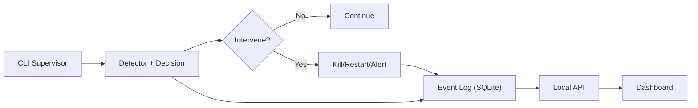
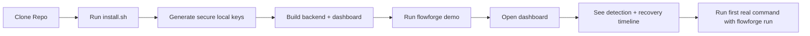
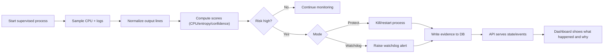
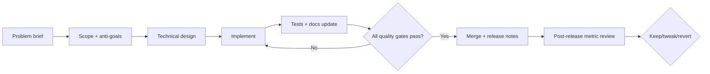
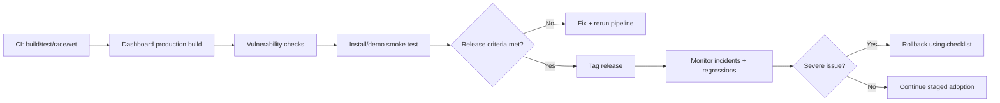

# FlowForge Product Execution Plan

Date: 2026-02-18
Owner: Product + Engineering
Scope: Local-first process supervision product (no SaaS, no multi-tenant, no billing)

---

## 1) Executive Summary

FlowForge should be operated as a focused reliability product for runaway process protection.
The fastest path to a high-trust product is:

1. Keep the product local-first and narrow.
2. Make first value obvious in under 60 seconds.
3. Make every intervention explainable.
4. Prioritize reliability and trust before expanding scope.
5. Delay enterprise-looking complexity until core behavior is proven.

This plan turns the repo into an execution workflow with phase gates, quality bars, and timelines.

---

## 2) Brutal Truths (Non-Negotiable)

1. Distribution beats architecture quality if users cannot discover and adopt the product.
2. A security/reliability tool is judged by false positives and trust, not UI polish.
3. If a user cannot explain why a process was killed, confidence collapses.
4. Complex architecture before usage data creates rework and slows delivery.
5. Most failures will come from operational discipline gaps, not missing features.
6. Cloudflare-level quality requires years of systems/process maturity, not one big rewrite.
7. A small team must win by focus: one persona, one painful problem, one excellent workflow.

---

## 3) Product Positioning (Current)

FlowForge is a local process guardrail that detects runaway behavior, intervenes safely, and explains every decision with auditable evidence.

Primary user now:
- Dev teams running long-lived AI agent jobs and automation scripts on laptops or CI runners.

Primary pain now:
- Jobs that silently loop, consume CPU, and waste time/resources.

---

## 4) Simplified Mental Model (4 Concepts)

1. Supervisor
- Starts and monitors one child process.

2. Decision
- Evaluates CPU/output repetition and computes confidence.

3. Action
- Continue, alert, kill, or restart.

4. Evidence
- Stores what happened, why it happened, and who triggered actions.

If every feature does not improve one of these four, postpone it.

---

## 5) Reduced Architecture (Target)

Key simplification rule:
- Prefer one event model that powers both timeline and decision explainability.

---

## 5.1) Node-Connected Workflows

### A) User Onboarding Workflow

ASCII fallback (plain text):
[Clone Repo] -> [Run install.sh] -> [Generate secure local keys] -> [Build backend + dashboard] -> [Run flowforge demo] -> [Open dashboard] -> [See detection + recovery timeline] -> [Run first real command with flowforge run]

### B) Runtime Detection Workflow

ASCII fallback (plain text):
[Start supervised process] -> [Sample CPU + logs] -> [Normalize output] -> [Compute scores] -> (Risk high?)
No -> [Continue monitoring]
Yes -> (Mode)
Protect -> [Kill/restart] -> [Write evidence to DB] -> [API serves state/events] -> [Dashboard explains what/why]
Watchdog -> [Raise alert] -> [Write evidence to DB] -> [API serves state/events] -> [Dashboard explains what/why]

### C) Feature Delivery Workflow (Engineering)

ASCII fallback (plain text):
[Problem brief] -> [Scope + anti-goals] -> [Technical design] -> [Implement] -> [Tests + docs update] -> (All gates pass?)
No -> [Implement]
Yes -> [Merge + release notes] -> [Post-release metric review] -> [Keep / tweak / revert]

### D) Release Safety Workflow

ASCII fallback (plain text):
[CI build/test/race/vet] -> [Dashboard production build] -> [Vulnerability checks] -> [Install/demo smoke] -> (Release criteria met?)
No -> [Fix + rerun pipeline]
Yes -> [Tag release] -> [Monitor incidents/regressions] -> (Severe issue?)
Yes -> [Rollback checklist]
No -> [Continue staged adoption]

---

## 6) Feature Workflow (Detailed)

Every feature must move through this exact workflow.

## 6.1 Workflow Stages

1. Problem Definition
- Output: one-page feature brief.
- Must include:
  - User pain statement.
  - Current workaround.
  - Why now.
  - Success metric.

2. Scope Decision
- Output: in/out list.
- Must include:
  - Must-have behavior.
  - Explicit anti-goals.
  - What will NOT be built now.

3. Technical Design
- Output: short design doc.
- Must include:
  - Data flow changes.
  - API/storage impact.
  - Failure modes and rollback.

4. Build
- Output: PR with tests and docs.
- Must include:
  - Unit/integration tests.
  - Migration safety.
  - Backward compatibility notes.

5. Verify
- Output: verification report.
- Must include:
  - Build/test/race/vet results.
  - Dashboard build result.
  - Security checks result.
  - Manual smoke scenario.

6. Release
- Output: release notes.
- Must include:
  - User-visible change.
  - Config changes.
  - Upgrade steps.
  - Known caveats.

7. Learn
- Output: post-release decision.
- Must include:
  - Metric impact after 1-2 weeks.
  - Keep/tweak/revert decision.

## 6.2 Stage Gates (Go/No-Go)

A feature cannot merge unless all are true:
- Gate A: Clear user pain and metric.
- Gate B: Scope and anti-goals documented.
- Gate C: Tests + docs updated.
- Gate D: No regression in run/demo onboarding flow.
- Gate E: Explainability preserved (reason is visible).

---

## 7) Feature Tracks and Priority Workflow

## 7.1 Track A - First 60-Second Value (P0)

Goal:
- New user experiences clear value in under 60 seconds.

Feature workflow order:
1. Installer reliability.
2. Demo determinism.
3. First-run messaging clarity.
4. Dashboard confirmation state.

Definition of done:
- Fresh machine install works in one command.
- Demo always shows detect -> intervene -> recover summary.
- User sees one clear timeline card explaining intervention.

## 7.2 Track B - Core Protection Reliability (P0)

Goal:
- Supervision behavior is correct and stable under real workloads.

Feature workflow order:
1. Detection signal tuning.
2. Intervention safety.
3. Process lifecycle edge-case handling.
4. Regression test pack.

Definition of done:
- False positive/false negative rates measured on a benchmark corpus.
- No goroutine leaks or shutdown orphan processes in tested scenarios.

## 7.3 Track C - Trust and Explainability (P0)

Goal:
- Every action is understandable by a developer in under 30 seconds.

Feature workflow order:
1. Unified reason text format.
2. Timeline simplification.
3. Decision evidence standardization.
4. Audit clarity.

Definition of done:
- For each intervention: what happened, why, and action outcome are present.

## 7.4 Track D - Operational Hardening (P1)

Goal:
- Product behaves predictably in production-like environments.

Feature workflow order:
1. Release pipeline reliability.
2. Dependency and vulnerability hygiene.
3. Runtime defaults hardening.
4. Operational runbook maturity.

Definition of done:
- CI green on all required checks.
- Vulnerability process documented and repeatable.

## 7.5 Track E - Scope Control (Always On)

Goal:
- Prevent feature creep and premature complexity.

Rules:
- Any feature not tied to current top-3 user pains gets deferred.
- Any architectural abstraction without proven usage is deferred.
- Any UI complexity that does not improve explanation quality is deferred.

---

## 8) What to Temporarily Remove or Consolidate

1. Consolidate overlapping evidence models
- Current: incidents + audit events + decision traces.
- Simplified target: one events pipeline with typed event categories.

2. Reduce alert mode branching in UI language
- Keep behavior, simplify wording to avoid overwhelming new users.

3. Remove non-core analytics from primary dashboard path
- Token/cost/savings can be secondary detail, not primary onboarding.

4. Trim non-essential command/doc noise
- Keep core commands prominent: run, demo, dashboard.

5. Avoid premature policy engine complexity
- Keep a small policy surface until real-world usage demands more.

---

## 9) 12-Week Detailed Timeline (Execution Plan)

## Weeks 1-2: Clarity + Scope Lock

Outcomes:
- Product story, architecture, and onboarding are coherent.

Deliverables:
1. README rewrite with:
- 60-second quickstart.
- 4-concept mental model.
- one architecture diagram.
- troubleshooting basics.

2. Terminology standardization:
- define exact terms: incident, decision, action, event.

3. Feature freeze policy:
- no net-new feature classes during 12-week cycle.

Exit criteria:
- New dev can explain product flow in 5 minutes.

## Weeks 3-4: Core Loop Reliability

Outcomes:
- run/demo path is deterministic and robust.

Deliverables:
1. Detection benchmark harness (fixture scripts).
2. Process lifecycle test matrix.
3. Graceful shutdown validation.
4. Decision reason formatting standard.

Exit criteria:
- benchmark report exists.
- no critical lifecycle failures in matrix.

## Weeks 5-6: Evidence Simplification

Outcomes:
- one coherent event narrative in backend + UI.

Deliverables:
1. Event model simplification design.
2. migration plan for existing DB schema.
3. timeline rendering simplification.
4. reason panel consistency check.

Exit criteria:
- user can trace one event end-to-end with no ambiguity.

## Weeks 7-8: Operational Hardening

Outcomes:
- repeatable secure release behavior.

Deliverables:
1. release checklist.
2. rollback checklist.
3. security maintenance checklist.
4. docs for API auth and local bind defaults.

Exit criteria:
- release dry-run succeeds with checklist compliance.

## Weeks 9-10: Pilot Readiness

Outcomes:
- ready for limited external pilot users.

Deliverables:
1. pilot onboarding guide.
2. issue intake template.
3. incident triage playbook.
4. top 10 failure-mode runbook entries.

Exit criteria:
- pilot users can self-serve onboarding with minimal support.

## Weeks 11-12: Stabilize and Decide

Outcomes:
- confidence to continue, narrow, or pivot.

Deliverables:
1. KPI review report.
2. top regressions and root cause summary.
3. next-quarter prioritized backlog.

Exit criteria:
- written keep/tweak/revert decisions for all major changes.

---

## 10) 12-Month Roadmap (Quarterly)

Q1 (0-3 months): Core Product Clarity
- deterministic onboarding and demo.
- stable supervision loop.
- clear evidence model.

Q2 (3-6 months): Pilot Reliability
- benchmark-backed detection tuning.
- hardening of release and runtime defaults.
- pilot user retention feedback loop.

Q3 (6-9 months): Production Readiness
- versioned API behavior commitments.
- stronger upgrade/migration story.
- comprehensive runbook maturity.

Q4 (9-12 months): Team Adoption
- improved team workflows and policy controls.
- selective integrations only if driven by pilot demand.

---

## 11) Success Metrics and Targets

## 11.1 Onboarding Metrics

1. Time-to-first-value
- Target: <= 5 minutes from clone to first successful demo.

2. Demo completion rate
- Target: >= 95% on supported environments.

## 11.2 Protection Metrics

1. Detection latency
- Target: intervention decision in <= 5 seconds for runaway fixtures.

2. False positive rate
- Target: <= 2% on benchmark corpus before broader rollout.

3. False negative rate
- Target: continuously tracked and reduced each sprint.

## 11.3 Reliability Metrics

1. Crash-free supervised sessions
- Target: >= 99%.

2. API availability (local runtime)
- Target: >= 99.9% during active session.

3. Clean shutdown success
- Target: >= 99% in lifecycle tests.

## 11.4 Trust Metrics

1. Explainability completeness
- Target: 100% of interventions include reason + action + outcome.

2. User confidence score (survey)
- Target: steady increase sprint-over-sprint.

---

## 12) Engineering Quality Workflow

## 12.1 PR Checklist (Required)

- [ ] Problem statement included in PR body.
- [ ] Scope and anti-goals listed.
- [ ] Unit/integration tests added or updated.
- [ ] Race detector clean.
- [ ] Vet/static/vuln checks clean.
- [ ] Dashboard build clean.
- [ ] README/docs updated if behavior changed.
- [ ] Rollback note included.

## 12.2 Testing Pyramid

1. Unit tests
- decision scoring math.
- auth/rate-limit behavior.
- parsing and normalization.

2. Integration tests
- run loop + DB writes.
- API endpoints with auth.
- timeline rendering contract.

3. Behavior tests
- runaway fixture.
- noisy but healthy fixture.
- restart path fixture.

4. Release smoke tests
- install script.
- demo execution.
- dashboard connection.

---

## 13) Security and Trust Workflow

1. Secrets discipline
- No committed keys or runtime state files.
- Enforced .gitignore and secret scanning checks.

2. Auth discipline
- mutating endpoints require key.
- constant-time compare remains mandatory.

3. Runtime exposure
- localhost bind default.
- strict CORS policy for local origins only.

4. Vulnerability maintenance
- recurring vuln check cadence.
- patch policy for toolchain and dependencies.

5. Disclosure discipline
- clear SECURITY.md and issue response timeline.

---

## 14) Documentation Workflow

Required docs and owner responsibilities:

1. README (Product owner)
- must tell the full story in one pass.
- must include quickstart, architecture, and common failures.

2. OPERATIONS.md (Infra owner)
- install/runbook/upgrade/rollback.

3. THREAT_MODEL.md (Security owner)
- trust boundaries and attack surface.

4. CHANGELOG (Release owner)
- user-facing diffs and migration notes.

Documentation quality gate:
- if behavior changes and docs are stale, PR does not merge.

---

## 15) Simplified Onboarding Flow (Target UX)

1. Clone repo.
2. Run install script.
3. Watch demo detect and recover.
4. Open dashboard and see one clear reason timeline.
5. Run one real command under supervision.

Expected first-run message quality:
- one sentence per step.
- no ambiguous debug language.
- clear next action on error.

---

## 16) Backlog Prioritization Framework

Priority model:
- P0: directly improves onboarding speed, core reliability, or trust.
- P1: improves operational quality but not critical for first value.
- P2: useful later; postpone unless user demand is explicit.

Current examples:

P0:
- README simplification.
- event model coherence.
- detection benchmark + false-positive tuning.
- lifecycle/shutdown reliability.

P1:
- deeper metrics refinement.
- optional UI polish around secondary stats.

P2:
- advanced policy abstractions.
- broad integration surface.
- anything not tied to current top-3 pain points.

---

## 17) Team Operating Cadence

Daily:
- 15-minute standup.
- blockers, incidents, active risks.

Weekly:
- reliability review (test failures, regressions, false positives).
- user feedback review.
- roadmap adjustment check.

Bi-weekly:
- release train with checklist review.
- post-release metric check.

Monthly:
- architectural debt review.
- threat model update check.

Quarterly:
- strategic scope reset.
- kill non-performing feature lines.

---

## 18) Risk Register (Top Risks + Mitigations)

1. Risk: False positives reduce trust.
- Mitigation: benchmark suite + explainability requirement + staged rollout.

2. Risk: Lifecycle bugs orphan processes.
- Mitigation: lifecycle matrix + forced kill fallback + shutdown tests.

3. Risk: Scope creep slows core quality.
- Mitigation: strict P0/P1/P2 governance and anti-goal review.

4. Risk: Documentation drift.
- Mitigation: doc update merge gate.

5. Risk: Security regressions.
- Mitigation: auth tests + vuln checks + secret scanning discipline.

---

## 19) Kill Criteria (When to Stop or Pivot)

If after two full quarterly cycles:
- time-to-first-value not improving,
- false positives still unacceptable,
- pilot retention weak,

then reduce scope further and revalidate core problem before adding any new features.

---

## 20) Immediate Next Actions (Next 7 Days)

1. Finalize README rewrite aligned to this plan.
2. Define and implement benchmark fixture set.
3. Create one-page feature brief template and enforce in PRs.
4. Publish release checklist and rollback checklist.
5. Run one end-to-end onboarding usability test with a new developer.

---

## 21) One-Paragraph Positioning Statement

FlowForge is a local reliability guardrail for long-running scripts and AI agent workflows: it supervises execution, detects runaway behavior, intervenes safely, and records clear, auditable reasons for every action so developers can trust automation without losing control.

---

## 22) Appendix - Feature Workflow Template

Use this template for every feature request:

1. Feature Name:
2. User Pain:
3. Success Metric:
4. In Scope:
5. Out of Scope:
6. Architecture Impact:
7. Failure Modes:
8. Test Plan:
9. Docs Impact:
10. Rollback Plan:
11. Release Validation:
12. Post-Release Review Date:

---

## 23) Ideal Domain Expansion Map (Cloudflare-Style Breadth, Sequenced)

Purpose:
- keep a large long-term vision without breaking short-term focus.
- expand by domains only after hard readiness gates are met.

Domain sequencing rule:
1. Core Runtime Reliability (must be excellent first)
2. Security Controls
3. Policy and Governance
4. Observability and Forensics
5. Deployment Surface
6. Ecosystem and Integrations

Readiness gate before opening any new domain:
- onboarding <= 5 minutes
- false-positive rate within target
- crash-free session target met
- release checklist and rollback drills passing
- docs/runbooks current

### Domain A) Core Runtime Reliability

Scope:
- stronger runaway classification profiles
- bounded restart policies
- deterministic shutdown and child cleanup
- command resource guardrails (cpu/mem/token-rate)

Example features:
- per-command runtime profile presets
- restart backoff and max restart window
- stuck-process timeout policy
- run replay summary from persisted events

Unlock criteria:
- baseline domain; always active until mature.

### Domain B) Security Controls

Scope:
- local auth hardening
- secret hygiene
- execution safety boundaries

Example features:
- signed local action approvals (optional)
- stricter endpoint permission tiers
- immutable audit export bundle
- key rotation helper workflow

Unlock criteria:
- Domain A stable with low operational incidents.

### Domain C) Policy and Governance

Scope:
- reusable policy packs for teams
- policy validation/linting
- policy simulation before enforcement

Example features:
- policy dry-run mode with impact report
- profile registry for team-standard policies
- confidence threshold policy packs by workload type
- policy conflict checker

Unlock criteria:
- Domain A and B stable, with clear user demand for shared policy.

### Domain D) Observability and Forensics

Scope:
- high-clarity operational timeline
- deeper forensic context for interventions
- robust benchmark and incident analytics

Example features:
- event correlation view (incident + decision + action chain)
- benchmark trend tracking across commits
- forensic export command (sanitized)
- anomaly score drift report

Unlock criteria:
- Domain A baseline metrics stable for two release cycles.

### Domain E) Deployment Surface

Scope:
- repeatable deployment across environments
- hardened packaging and upgrade safety

Example features:
- hermetic build profile
- offline install bundle
- migration preflight checker
- host capability validator

Unlock criteria:
- runbooks mature and rollback drills proven.

### Domain F) Ecosystem and Integrations

Scope:
- connect to existing dev workflows without bloating core

Example features:
- CI adapters (consume events and enforce policy outcome gates)
- chat notifications for intervention summaries
- issue tracker incident export
- SIEM-friendly JSON event stream exporter

Unlock criteria:
- Domain A-D stable and clear integration pull from users.

---

## 24) Feature Universe Backlog (Ideal, Not Immediate)

These are intentionally broad and should remain parked until domain gates open.

Reliability universe:
- workload fingerprinting
- adaptive threshold tuning from local history
- bounded auto-remediation playbooks
- run safety scorecard

Security universe:
- tamper-evident local audit chain
- host integrity prechecks before run
- secret source scanning of process output channels
- policy-based kill approval modes

Policy universe:
- policy templates by language/runtime
- policy provenance metadata
- policy test harness fixtures
- policy rollout canary mode

Observability universe:
- incident diff between two runs
- confidence decomposition timeline
- postmortem report generator from event graph
- benchmark comparison CLI

Operations universe:
- upgrade planner with migration checks
- environment compatibility matrix command
- release health snapshot command
- disaster recovery checklist automation

Integrations universe:
- git hook guardrail mode
- pipeline status gate mode
- message bus exporter (local forwarding)
- standardized event schema adapters

---

## 25) Anti-Overbuild Rules For Domain Expansion

1. No domain expansion if P0 metrics are below target.
2. No new domain features without a named design-partner request pattern.
3. No architecture abstraction added unless used by at least two active features.
4. No integration feature before core event schema is stable for two cycles.
5. Every new domain feature must include removal criteria if adoption is weak.

---

## 26) Domain Planning Template

Use this before opening a domain:

1. Domain Name:
2. Why now:
3. User pull evidence:
4. Prerequisite gates status:
5. First 3 features (max):
6. Success metrics:
7. Failure signals:
8. Rollback/retire plan:
